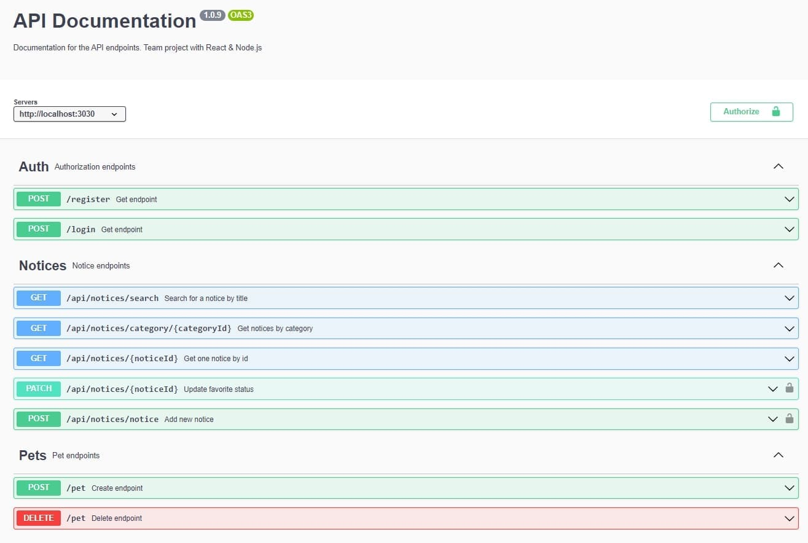

# 🐾 PET PARADISE 🐾

## 🐾 Command Project // React & Node.js 🐾

It is an online platform that allows users to find and exchange small furry
friends such as 🐈 animals and birds. On this application, you will be able to
view ads about different types of animals 🐕‍🦺 that are for sale or available for
purchase, as well as post your own ads. You will be able to search and filter
ads by various criteria, such as type of animal 🐕, location 🐻‍❄️, price and much
more. This app provides an opportunity to find a new little furry friend or find
a new owner for your favorite animal 🦮.

## View the app [front-end repository](https://truemolni.github.io/your-pet-project-frontend).

## To learn more about the frontend, follow the link [front-end repository](https://github.com/TrueMolni/your-pet-project-frontend).

## 💻 Tech Stack

**_Client:_** React, Redux Toolkit, Styled Components
[ . . . ](https://github.com/fantusya/petly)

**_Server:_** Node.js, Express.js, MongoDB, Multer, Cloudinary, Google sign-In,
JWT, Swagger

## 🔥 Swagger

💿 [Swagger](https://app.swaggerhub.com/templates/NREACT25_1/Pets/1.0.0)

## 👍 Our backend team

👩‍💻 [Yuriy Orekhov](https://www.linkedin.com/in/yuriy-orekhov/)

👧 [Yuliya Donets](https://www.linkedin.com/in/yuliya-donets/)

👨🏻‍💻 [Andrii Chuiko](https://www.linkedin.com/in/andrii-chuiko/)

### Команди:

- `npm start` &mdash; старт сервера в режимі production
- `npm run start:dev` &mdash; старт сервера в режимі розробки (development)
- `npm run lint` &mdash; запустити виконання перевірки коду з eslint, необхідно
  виконувати перед кожним PR та виправляти всі помилки лінтера
- `npm lint:fix` &mdash; та ж перевірка лінтера, але з автоматичними
  виправленнями простих помилок
- `npx nodemon server.js` &mdash; запускаємо сервер з використанням nodemon {
  npm i --save-dev nodemon }
- `http://localhost:3030/api-docs/` &mdash; Swagger
